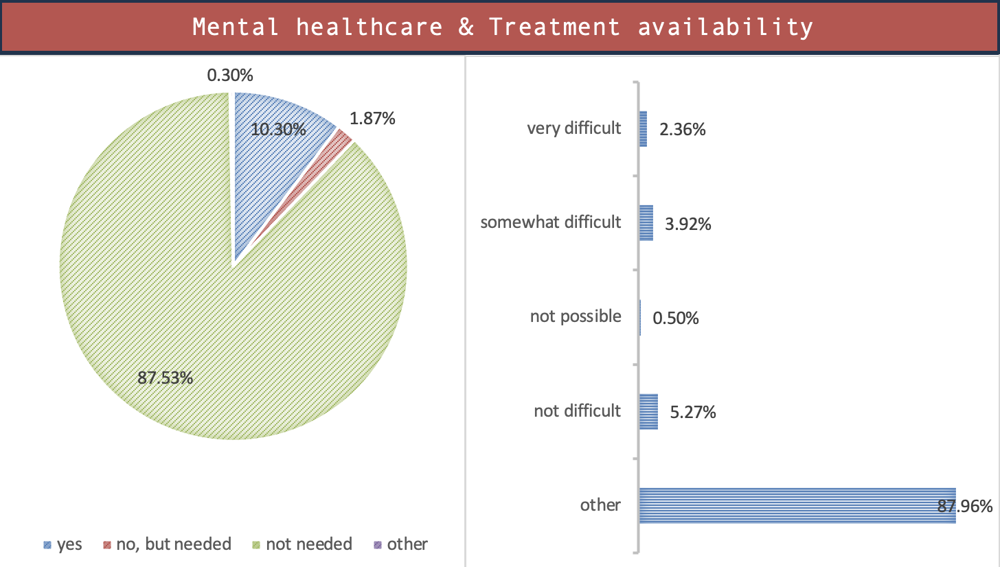
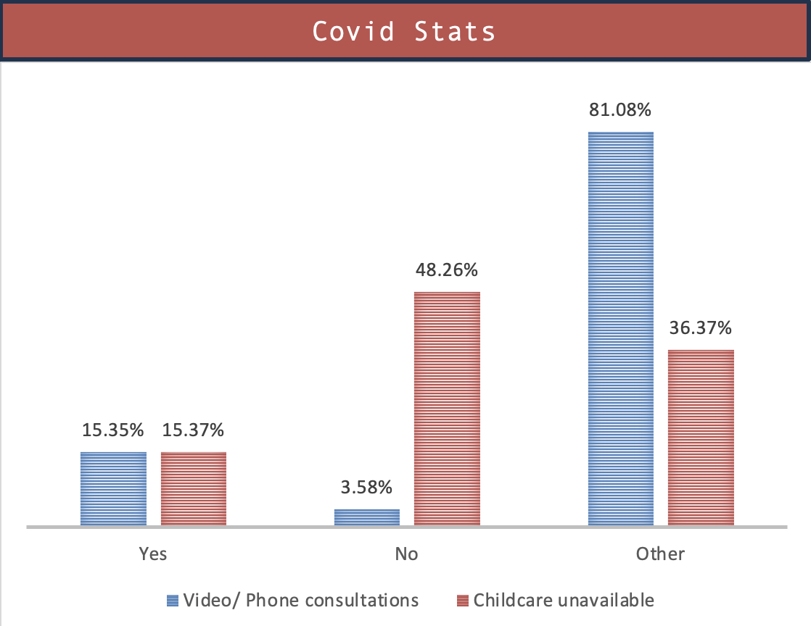

# Project Background

HealthGuard operates on a B2C and B2B hybrid model, offering health insurance plans tailored to individuals, families, and businesses. The company relies on a subscription-based revenue model, collecting premiums monthly or annually from policyholders while managing claims, preventive care services, and customer satisfaction. Key KPIs include healthcare service accessibility, and healthcare adoption rates.

In this project, I conducted a comparative analysis of healthcare access and utilization among children with public and private insurance plans using publicly available data from the Child and Adolescent Health Measurement Initiative (CAHMI) for 2021-2022. The study evaluated critical metrics such as general medical care, preventive care visits, unmet healthcare needs, and family-centered care experiences.
The findings were presented in interactive dashboards to enable stakeholders to visualize trends, identify disparities, and explore opportunities to improve customer satisfaction and align with organizational KPIs. These insights aim to support data-driven strategies that enhance healthcare access and utilization for insured children.

Insights and recommendations are provided on the following key areas:
- Healthcare access and utilization
- Employment and income influences on insurance choice
- Unmet healthcare needs and Family-Centered care
- Mental healthcare & treatment availability
- COVID-19 impact on healthcare access

# Data Structure & Initial Checks

### Data Exploration and Filtering: 
The dataset includes details on children insured by public, private, both, or neither insurance types. For this analysis, only public and private insurance data is considered. The CAHMI data dictionary was used to select relevant columns and ensure accurate data transformation. Column names were then renamed for clarity and consistency with the project's terminology. The variables in this dataset are categorical, either nominal or ordinal.  
  
  

The Python code written to clean and filter data is available [here](insurance_health.ipynb).

The Excel file where all the data manipulation was done can be found [here](filtered_data.xlsx).

### Data cleaning (Python): 
- Imported the dataset into a pandas dataframe. Reviewed the data types and checked for missing values using isnull().
  
  
- Replaced '?' values with NaN using numpy.
  
  
- Created a bar plot to compare the percentage of children with different types of insurance using matplotlib.
  
  
- Filtered the dataset to include only children with public or private insurance. The cleaned dataset is available for download as filtered_data.xlsx.
  
  

### Data manipulation (Excel): 
I chose Excel for its user-friendly interface, robust built-in functions, and ease of creating visualizations. To compare different types of healthcare services (General Medical Care, Dental Care, Eye Care) for children with public versus private insurance, I utilized pivot tables and slicers to generate the bar charts. 
- For example, I created pivot tables by pulling the ‘MEDICAL_CARE’ variable into the Values and Legend sections.
- Formatted the values to summarize by count and display percentages of the grand total.

  
- After setting up the pivot table, selected the data and inserted a 2D column chart through Insert > Chart > 2D Column.
- Added a slicer for dynamic filtering by selecting PivotTable Analyze > Insert Slicer and choosing the ‘INSURANCE_TYPE’ column. This allows for seamless toggling between public and private insurance data views.

  
 
### Data visualization: 
After creating the pivot tables and their corresponding charts/graphs, I consolidated them into a single worksheet to build a comprehensive, dynamic dashboard. This setup allows for an interactive experience where users can visualize the percentage distribution of various healthcare services and benefits by selecting either public or private insurance using the slicer at the top. This approach provides a clear and immediate comparison between the two insurance types in a single, cohesive view.

  
 
# Executive summary

### Overview of findings
This analysis reveals key disparities in healthcare access between children with private and public insurance. Children with private insurance have better access to general medical care and preventive services, with 84.08% of private insurance holders having preventive care visits compared to 77.31% of those with public insurance. Conversely, public insurance participants have better access to dental and eye care. Employment status strongly influences insurance selection, with caregivers in the 200-399% and 400% FPL categories primarily choosing private insurance, while those in the 0-99% and 100-199% FPL categories lean towards public insurance.
Additionally, private insurance participants report fewer unmet healthcare needs (3%) compared to public insurance participants (5%), and they also report fewer frustrations accessing care, with 2.14% of private insurance holders expressing frustration versus 4.59% of public insurance holders.

# Insights Deep Dive
### Healthcare access and utilization:
- Healthcare Comparison (General, Dental, Eye): Private insurance participants generally received more general medical care, while public insurance holders had higher access to dental and eye care services.
- Preventive Care: 84.08% of private insurance participants had preventive care visits, compared to 77.31% of public insurance participants.

  
  

### Employment and income influences on insurance choice:
- Insurance Choice: Caregivers in higher income brackets (200-399% FPL, 400% FPL) favored private insurance, while those in lower income brackets (0-99% FPL, 100-199% FPL) predominantly chose public insurance.

  
  
  
### Unmet healthcare needs and Family-Centered care:
- Unmet Healthcare Needs: 8% of participants reported unmet healthcare needs; 5% were public insurance holders, while 3% had private insurance. Public insurance holders also reported higher frustration with accessing services (4.59% vs. 2.14% for private insurance).

  
  
- Family-Centered Care: Private insurance participants reported better experiences with family-centered care, including careful listening, time spent, and involvement.

  
  

### Mental healthcare & treatment availability:
- Mental Healthcare Access: 95% of private insurance participants found it easy to access mental healthcare, compared to a lower percentage of public insurance participants.

  
  

### COVID-19 impact on healthcare access:
- Healthcare Access During COVID-19: Private insurance participants had better access to video/phone consultations. However, public insurance participants (48.26%) reported more availability of childcare services compared to private insurance participants (41.66%).

  
  

# Recommendations
Based on the findings of the comparative analysis of healthcare access and utilization for children with public and private insurance plans, we recommend the following to support HealthGuard’s objectives and improve customer satisfaction:
1.	Improve preventive care adoption: Expand preventive care availability for public insurance holders through partnerships with community providers and targeted support for low-income families.
2.	Income-tailored insurance options: Introduce affordable private insurance packages for families in lower-income brackets (0-199% FPL), emphasizing benefits like reduced out-of-pocket costs and enhanced preventive care.
3.	Close gaps in healthcare needs:
o	For public insurance: Streamline claims and improve access to essential services to address unmet needs.
o	For both plans: Enhance service quality with faster claims processing and seamless communication.
4.	Strengthen family-centered care: Focus on improving family-centered care experiences for public insurance participants by increasing service flexibility, enhancing provider communication, and prioritizing family involvement in care decisions.
5.	Expand mental healthcare access:
o	For public insurance: Broaden mental health service options via telemedicine and community partnerships to reduce barriers and wait times.
o	For private insurance: Highlight mental health benefits in marketing to attract families prioritizing mental wellness.
6.	Enhance virtual healthcare post-COVID-19: Improve telehealth services for all participants and explore childcare support for private insurance holders as a value-add to differentiate plans.

